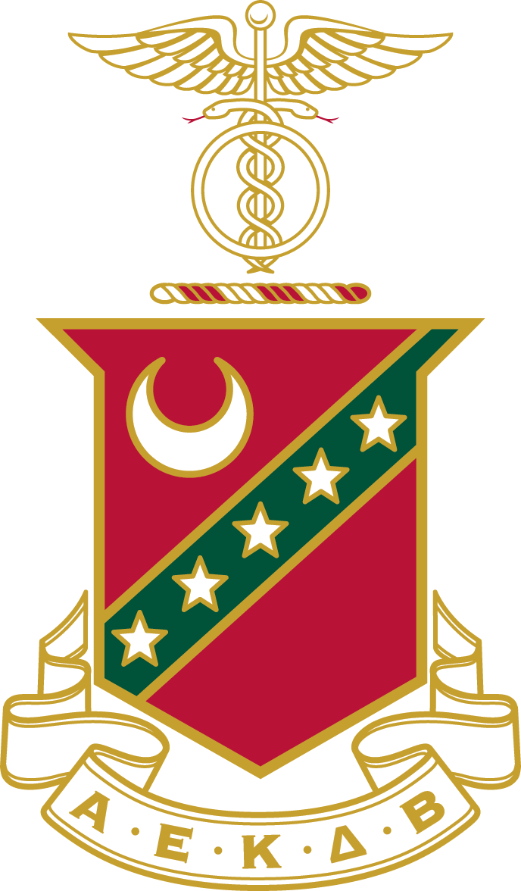
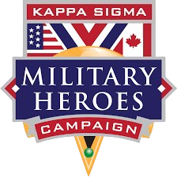

# Kappa Sigma - Gamma-Nu | Military Heroes Gala 2025

A website for the 2025 Military Heroes Gala hosted by the Gamma-Nu chapter of Kappa Sigma at Washburn University. Built to inform, invite, and inspire support for veterans through the Military Heroes Campaign.





## 🌐 Live Site

> [https://ks-military-heroes-gala.vercel.app/](https://ks-military-heroes-gala.vercel.app/)

## 📌 About the Gala

The Military Heroes Gala is the Gamma-Nu chapter’s largest philanthropic event, supporting veteran-focused nonprofit initiatives.

## ✨ Features

- 🔗 RSVP & donation links (LegFi, Venmo, CashApp)
- 📅 Event schedule and guest info
- 🛡 Info about the Military Heroes Campaign
- 📜 Chapter history and mission
- 📱 Mobile responsive design
- 💅 Styled with Tailwind CSS and custom color theme

## 🧱 Tech Stack

- [React](https://reactjs.org/)
- [Vite](https://vitejs.dev/)
- [Tailwind CSS v4](https://tailwindcss.com/)
- [Lucide React Icons](https://lucide.dev/)
- Hosted on [Vercel](https://vercel.com/)

## 🚀 Getting Started

Follow these steps to set up the project locally and understand how it's organized:

### 🔧 1. Clone and install

```bash
# Clone the repository
git clone https://github.com/EliChapman/wu-kappa-sigma-website.git
cd wu-kappa-sigma-website

# Install all required dependencies
npm install
```

### 🔄 2. Run in development mode

```bash
npm run dev
```

Starts the local dev server with hot reloading.  
Visit: http://localhost:5173

### 🏗 3. Build for production

```bash
npm run build
```

Compiles the app to the `/dist` folder, ready for deployment.

## 📁 Project Structure & Components

| Path                           | Description                                                                 |
|--------------------------------|-----------------------------------------------------------------------------|
| `src/pages/`                   | Top-level views: `Home`, `Event`, `Donate`, `About` — location of all page content    |
| `src/components/Header.jsx`   | Sticky responsive navbar with mobile dropdown menu                          |
| `src/components/Footer.jsx`   | Footer with links, social icons, and attribution                           |
| `src/components/FullBanner.jsx` | Reusable hero/banner with optional background image or color overlay       |
| `src/components/ScrollToTop.jsx` | Scrolls to top on route change (React Router fix)                         |
| `src/assets/`                 | Logo, crest, QR codes, and other image assets                              |
| `index.css`                   | Tailwind base + custom styles (fonts, variables, scrollbars, etc.)         |

## 🌐 Deployment

This site is fully static and built for deployment on [Vercel](https://vercel.com/).  
After `npm run build`, deploy the `/dist` folder or connect the GitHub repo to Vercel for CI/CD.

# 🛠 How to Update the Website

### Option 1: Online via GitHub (no coding required)
1. Go to https://github.com/[your-org]/[your-repo]
2. Click on any file (like `src/pages/Event.jsx`)
3. Click the pencil ✏️ to edit
4. Make your changes (e.g., update the event date or donor link)
5. Scroll down → "Commit changes"
6. Follow the steps to submit a pull request

Vercel will automatically rebuild the site within 30–60 seconds.

### Option 2: Local Edits (for developers)

```bash
git clone https://github.com/[your-org]/[your-repo].git
cd your-repo
npm install
npm run dev
```
Then, edit components in `src/pages` or `src/components`

## 📜 License

This website and its contents are the intellectual property of the Gamma-Nu chapter of Kappa Sigma Fraternity.

All rights reserved.  
This project is not licensed for reuse, modification, or redistribution.  
Developed by Eli Chapman under commission for Gamma-Nu.

© 2025 Gamma-Nu Chapter, Kappa Sigma Fraternity